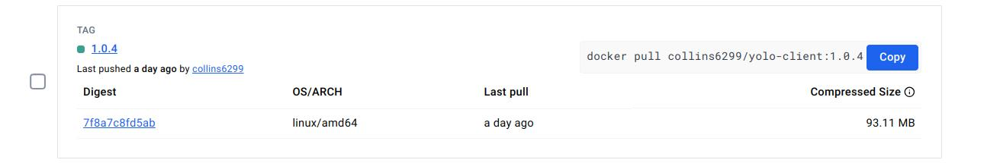
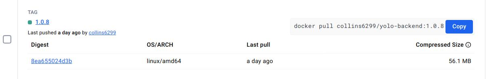

## Choice of the Base Image

 + `NODE_VERSION` =`19.0.0-alpine3.16`

The base image `node:${NODE_VERSION}`  is selected for its lightweight nature and pre-installed Node.js, ensuring efficient and secure builds for a Node.js application. The version `NODE_VERSION` provides flexibility for using different Node.js versions as needed.

## Dockerfile Directives

+ `FROM node:${NODE_VERSION}`: Specifies the base image.
+ `WORKDIR /usr/src/app`: Sets the working directory in the container.
+ `ENV NODE_OPTIONS=--openssl-legacy-provider`: Sets an environment variable.
+ `COPY . .` and `COPY package.json package-lock.json ./`: Copies files from your host to the container.
+ `RUN npm install --production` and `RUN npm run build`: Executes commands in the container.
+ `EXPOSE 3000`: Informs Docker that the container listens on the specified network ports at runtime.
+ `CMD ["npm", "start"]`: Provides defaults for an executing container.

# Docker Compose File Explanation

This `docker-compose.yml` file defines two services: `backend` and `client`.

## Docker-compose Networking

In the `docker-compose.yml` file, a bridge network named `node-network` is created. Both the `backend` and `client` services are connected to this network, allowing them to communicate with each other.

The `ports` directive is used to map the container's ports to the host's ports. For the `backend` service, port 5000 of the container is mapped to port 5000 of the host. For the `client` service, port 3000 of the container is mapped to port 3000 of the host. This allows the application to be accessed via these ports on the host machine.

```yaml
networks:
  node-network:
    driver: bridge
```

## Docker-compose Volume Definition and Usage

In Docker Compose, volumes are defined and used via the `volumes` directive in the service definition. Volumes are used for persisting data generated by and used by Docker containers.

In the provided `docker-compose.yml` file, two types of volumes are used: bind mounts and anonymous volumes.

### Bind Mounts

A bind mount is a type of volume that maps a directory or a file from the host into a container. Any changes made to the directory or file on the host will be reflected in the container, and vice versa.

In the `backend` and `client` services, a bind mount is created from a path on the host (`./node` for `backend` and `./client` for `client`) to a path in the container (`/usr/src/app/node` for `backend` and `/usr/src/app` for `client`). This allows the application code to be shared between the host and the container.

```yaml
volumes:
  - ./node:/usr/src/app/node
  - ./client:/usr/src/app
```
### Building, Tagging, and Pushing Docker Images

Before building the Docker image, you need to navigate to the directory containing the Dockerfile. This can be done using the `cd` command.

```bash
# Navigate to the 'backend' directory
cd backend

# Or navigate to the 'client' directory
cd client

# Build the Docker image and tag it
docker build -t colllins6299/imagename:version .

# Build the Docker image, tag it, and push it to the registry
docker build -t colllins6299/imagename:version . --push

```
### Running of Containers

Running containers in Docker is done using the `docker run` command. However, when using Docker Compose, you can start all services defined in the `docker-compose.yml` file with a single command: `docker-compose up`.

```bash
# Start all services
docker-compose up -d

#start indivual services
docker-compose up -d client

docker-compose up -d backend

```


### Docker Images screenshots
+ + client



+ + backend


