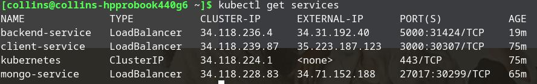
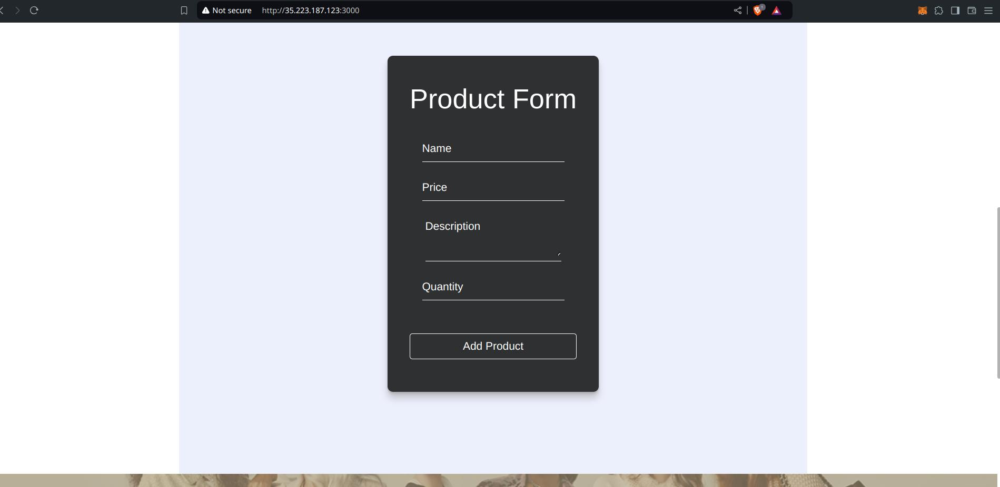

# Microservice Orchestration with Kubernetes (Yolo)
## Deployment Explanation
## External IP To Access the Application

[Client application Endpoint/External IP ](http://35.223.187.123:3000/)

## Overview

This document explains the process of deploying ExpressJs and reactJs application to Google Cloud Kubernetes Engine (GKE). The application consists of a backend service connected to a MongoDB database and a client service.

## Prerequisites
- Google Cloud Account: Ensure you have an active Google Cloud account if not signin or signup.
- Billing Enabled: Billing must be enabled on your Google Cloud project.
- Google Cloud SDK: Installed and configured on your local machine.
- Kubectl: Installed and configured on your local machine.
- Minikube: Installed and running on your local machine.

### Installing Minikube
 For Linux users

     curl -LO https://storage.googleapis.com/minikube/releases/latest/minikube-linux-amd64
     sudo install minikube-linux-amd64 /usr/local/bin/minikube

To confirm if minikube is installed succesfully, run the following command

     minikube version

Expected output

     minikube version: v1.33.1

To Start Minikube

     minikube start

Check if minikube is running

     minikube status

To stop minikube

    minikube stop
### Download and Install Google Cloud SDK

Update and Install Dependencies

    sudo apt-get update
    sudo apt-get install -y curl python3

Download the Google Cloud SDK

    curl -O https://dl.google.com/dl/cloudsdk/channels/rapid/downloads/google-cloud-sdk-488.0.0-linux-x86_64.tar.gz

Extract the Archive

    tar -xf google-cloud-sdk-488.0.0-linux-x86_64.tar.gz

Run the Installation Script

    ./google-cloud-sdk/install.sh

You will be prompted to modify your profile to include the Cloud SDK path. Confirm the prompts to update your profile.

Initialize the SDK

    ./google-cloud-sdk/bin/gcloud init

### Configure Google Cloud SDK

1.Log In to Your Google Cloud Account

    gcloud auth login

Follow the instructions to log in to your Google account via the web browser.

2.Set the Default Project

    gcloud config set project [YOUR_PROJECT_ID]
    
Replace [YOUR_PROJECT_ID] with the ID of your Google Cloud project.
    
Example:

    gcloud config set project kevin-yolo

3.Set the Default Compute Region and Zone
    
    gcloud config set compute/region [YOUR_REGION]
    gcloud config set compute/zone [YOUR_ZONE]
    
Replace [YOUR_REGION] and [YOUR_ZONE] with your preferred region and zone, respectively.

### Verify Installation

To verify that the installation and configuration were successful, you can run:

    gcloud --version

To provides detailed information about your gcloud configuration, including the current project and active account.

    gcloud info

### Prepare the Environment
1.Log in to Google Cloud

    gcloud auth login

2.Set the Project

    gcloud config set project [PROJECT_ID]

Example in my case :-

    gcloud config set project kevin-yolo

3.Enable Required APIs

    gcloud services enable container.googleapis.com

### Create a Kubernetes Cluster
1.Create the Cluster

    gcloud container clusters create [CLUSTER_NAME] --zone [ZONE] --num-nodes=3

Example :- 
    
    gcloud container clusters create my-cluster --zone us-central1-c --num-nodes=3

2.Get Cluster Credentials

    gcloud container clusters get-credentials [CLUSTER_NAME] --zone [ZONE]

Example :- 

    gcloud container clusters get-credentials my-cluster --zone us-central1-c

### Deployment Steps

Create directory
    
    mkdir k8s

 Then add the below folders and files inside:
    mkdir backend
       touch yolo-backend-deployment.yaml 
       touch olo-backend-service.yaml

    mkdir client
       touch yolo-client-deployment.yaml 
       touch yolo-client-service.yaml

    mkdir mongodb
       touch mongodb-pv-yaml
       touch mongodb-pvc-yaml
       touch mongodb-service.yaml
       touch mongodb-statefulset.yaml

Execute the below comands

    kubectl apply -f k8s/mongodb
    kubectl apply -f k8s/backend
    kubectl apply -f k8s/client

This will create `pods`

To view if pods and services have been created execute the below command.

    kubectl get pods
    kubectl get services

Incase of an Error run the below command with the deployment name. This will show `logs` or show more infomation about the `pod` created

    kubectl logs
    kubectl describe

Example
    
    kubectl logs clients-deployment

### Verify Deployment

1.Check Services
Ensure that the services are created and exposed correctly:

    kubectl get services

### Accessing the Application

We access the client service using the external IP and port provided by the service.

    http://35.223.187.123:3000/

### YOLO External Link

1[Client application Endpoint/External IP ](http://35.223.187.123:3000/)

### Troubleshooting
1.Pods Not Running

If a pod is not running or is in a CrashLoopBackOff state, check logs:

    kubectl logs [POD_NAME]

Inspect the pod description for detailed error information:

    kubectl describe pod [POD_NAME]

## Conclusion

Following these steps, you should have successfully deployed your application from a local Minikube environment to Google Cloud Kubernetes Engine. This setup provides scalability and management benefits by leveraging Google Cloud’s Kubernetes infrastructure.

### LInks to Refer

- [Google Kubernetes Engine Documentation](https://cloud.google.com/kubernetes-engine/docs)

- [Kubernetes Documentation](https://kubernetes.io/docs/home/)